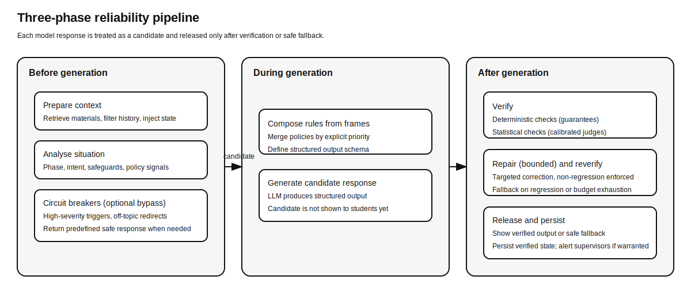
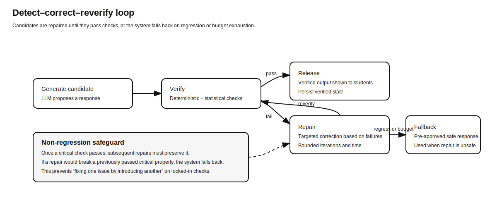

# A Layered Reliability Framework for Trustworthy AI in Education

*Luca Leisten\** (ETH Zurich)  
*Olga Muss\** (Université de Neuchâtel, ETH Zurich)  
*Charles Edouard Bardyn* (AI Swiss)

\*These authors contributed equally to this work

Correspondence: <!-- TODO: corresponding author name --> (<!-- TODO: corresponding author email -->)

<!--
TODO (for Scientific Reports submission readiness):
- TODO: Finalise Figures 1–2 for submission (check font size/legibility, export format if required by the journal).
- TODO: Export Figures 1–2 to journal-preferred vector formats (e.g., PDF/EPS) and upload as separate figure files.
- TODO: Populate Results with empirical numbers (detection rates, correction success, fallback frequency, latency/cost; baseline comparisons; learning outcome indicators).
- TODO: Add judge calibration results vs human labels (precision/recall; inter-rater agreement κ).
- TODO: Complete ethics details for minors (IRB approval ID, consent/assent, data handling/anonymisation, retention, right to withdraw).
- TODO: Complete model configuration details (provider, exact model/version/build, access date, safety settings, handling of provider model updates).
- TODO: Verify references and in-text citations remain consistent after final editing (numbered/Vancouver).
- TODO: Verify and pin down adoption statistics and citation granularity (WIP-CH 2025 reference details; Internet Matters age-band figure currently expressed as a range).
-->

---

## Abstract

Large language models (LLMs) are increasingly used in education, yet their outputs remain probabilistic and difficult to verify. In settings involving minors, even rare failures (unsafe content, inappropriate tone, or pedagogically harmful assistance) can undermine trust. Prompting and fine-tuning can shape model behaviour, but they cannot guarantee turn-level compliance.

We present a layered reliability framework that surrounds generation with external verification, targeted repair, and safe fallback. The framework implements a bounded detect–correct–reverify loop with a non-regression safeguard that prevents repairs from introducing new critical failures. It distinguishes deterministic checks (code-enforced predicates with explicit guarantees) from statistical checks (AI-judged properties with measured error rates calibrated against human labels). This separation makes clear what can be guaranteed as written versus what is monitored probabilistically.

We validate the approach in a classroom deployment with 13–15-year-old students using a voice-based assistant. Each group interacted with a **prompt-only** baseline and then with the **full framework**. Across <!-- TODO: N --> interactions, <!-- TODO: X% --> of full-framework initial candidates failed at least one check; <!-- TODO: Y% --> were repaired within budget and <!-- TODO: Z% --> triggered a safe fallback. In the full framework condition, no response failing our implemented deterministic validators or judge-based gates was released to students (enforced by code). To estimate residual risk from judge false negatives—and to quantify differences versus prompt-only—we additionally report a blinded human audit of <!-- TODO: M --> released turns, with residual policy violations in <!-- TODO: R% --> (95% CI <!-- TODO -->). Median end-to-end latency in the full framework condition was <!-- TODO: X --> ms (IQR <!-- TODO -->–<!-- TODO -->).

**Keywords:** AI safety, education technology, language models, reliability engineering, verification, quality education (SDG 4)

---

## Introduction

Generative artificial intelligence is now a routine part of young people’s digital lives. In Switzerland, 84% of 14–19-year-olds report regular use of generative AI (survey of 1,100 Swiss residents, 2025) [1]. Usage is lower among older groups: 60% of 30–49-year-olds and less than 40% of 50–69-year-olds report regular use [1]. In the United Kingdom, 53% of 9–11-year-olds and 67% of 15–17-year-olds report regular use of AI chatbots [2]. As these systems are embedded into the platforms students already use, schools face a dilemma. Learners need opportunities to understand and responsibly use AI, but schools also carry heightened safeguarding obligations because children’s cognitive and emotional development is ongoing and their ability to critically evaluate AI outputs is limited [3].

The risks in educational deployment are not hypothetical. They include privacy and data governance concerns, inappropriate or unsafe responses, over-reliance and erosion of independent reasoning, and misplaced trust in fluent but incorrect explanations [4–6]. International policy guidance increasingly calls for child-centric AI design that prioritises safety, transparency, and accountability [26]. Policy responses range from outright bans to regulation and AI literacy initiatives. Notably, the EU Artificial Intelligence Act classifies educational AI as “high-risk”, increasing requirements for transparency, robustness, and human oversight [7]. Yet even well-intentioned deployments struggle with the central obstacle: trust. Educators cannot responsibly use systems whose behaviour cannot be verified, especially when rare failures can directly affect students.

Current techniques for steering LLM behaviour are valuable, but they are insufficient as reliability mechanisms. Training-time alignment via reinforcement learning from human feedback (RLHF) is provider-controlled and difficult to customise. Fine-tuning can improve task fit, but the result remains probabilistic. Prompt engineering and constitutional prompting can reduce undesirable outputs, yet they cannot guarantee compliance on every turn. Their influence can also weaken as conversation history grows, so a rule that holds early in a dialogue may be overridden by later context [8].

Post-hoc filters can block certain content, but they typically act as binary gates without targeted repair [9]. Structured decoding can enforce output form, yet it often requires access to model internals and does not itself guarantee pedagogical or safety properties [10]. Recent work also demonstrates that structured output constraints can be exploited as an attack surface [25].

Self-refinement methods ask the model to critique and revise its own outputs [21,22], but they inherit the same stochastic failure modes as the original generation. A model asked "Did you just reveal the answer?" may answer "No" while having done exactly that.

Recent work further shows that LLMs often fail to detect their own errors [23] and that certain mistakes are systematically overlooked due to "self-consistent" blind spots shared between generator and evaluator [24]. External verification has been shown to catch errors the generating model misses [11–14]. Overall, these approaches try to extract reliability from an inherently probabilistic component.

We take a different approach: we treat generation as a noisy channel and engineer reliability at the system level. Inspired by error correction and redundancy in information theory [15,16], we surround generation with independent checks, iterative repair, and safe fallback. The design goal is not to make the model "perfect", but to ensure that students are exposed only to outputs that pass an explicit verification process (covering both deterministic rules and AI-judged criteria), under bounded time and cost.

Two complementary perspectives motivate this work. On the human side, educational practice benefits when learners remain intellectually active: the concept of human–AI co-thinking frames the AI as a tool that supports students' reasoning rather than replacing it [17,18]. On the system side, we introduce a layered reliability framework with three core mechanisms:

1. **Deterministic checks** enforce rules that can be written in code (e.g., schema compliance, explicit blocklists, response-length limits). These provide absolute guarantees relative to a trusted computing base—the verified core code that we assume has no bugs.

2. **Statistical checks** evaluate semantic and pedagogical properties (e.g., "does this reveal the answer?") using calibrated AI judges. These are probabilistic with known error rates, not certainties.

3. **A detect–correct–reverify loop** gives the system a chance to fix violations and re-check them. A non-regression safeguard enforces monotonic non-regression: once a critical rule passes, subsequent repairs must preserve it (meaning a fix never re-introduces an error that was already fixed). If a fix would regress, or if the budget (iterations and time) is exhausted, the system returns a pre-approved safe fallback.

This paper makes four contributions:

1. A **layered reliability framework** that operationalises "trust" as externally verified compliance rather than prompted intent.
2. A **verification taxonomy** that separates deterministic guarantees from statistical best-effort checks (with measured error rates), enabling honest capability communication to educators and regulators.
3. A **composable specification model** ("frames"): modular rule bundles with explicit priority, designed to support auditable configuration and rapid iteration by educators.
4. **Empirical validation** in a classroom deployment with 13–15-year-old students, reporting gate failure rate (pre-release), repair success and fallback frequency, latency and cost, judge calibration against human labels, and a blinded human audit of released outputs to estimate residual risk.

Together, these contributions provide a practical pathway toward safer, more transparent educational AI systems aligned with SDG 4 (Quality Education).

---

## Results

This section reports (i) the framework design as implemented in our system and (ii) empirical outcomes from a classroom deployment. For readability, algorithmic pseudocode and additional implementation details are provided in Supplementary Information (Sections S1–S4).

### Framework design: A layered reliability pipeline

Educational deployments require that students see only outputs satisfying clearly defined constraints. We therefore treat each LLM generation as a candidate and, in the full framework condition, release it only after external verification. Figure 1 summarises the pipeline in three phases. Before generation, the system prepares context, analyses the situation, and applies circuit breakers. During generation, it composes rules from active frames and produces a structured response. After generation, it verifies the candidate, repairs if needed, persists only verified state, and alerts supervisors when warranted.

**Figure 1: Three-phase reliability pipeline.** The system treats each model response as a candidate and releases it only after verification. Circuit breakers can bypass generation for predefined cases; otherwise, candidate outputs are generated under composed frame rules, then verified, repaired if needed, and released or replaced by a safe fallback.



#### External verification with explicit guarantee types

A central contribution is a verification taxonomy that distinguishes what the system can guarantee as written from what it can only monitor. Table 1 illustrates the distinction.

**Table 1: Verification types and what they guarantee.**

| Verification type | Example check | What is guaranteed (as written) |
|---|---|---|
| Deterministic (code-enforced) | Response conforms to schema | Output fields exist and parse under the specified schema (relative to the trusted computing base) |
| Deterministic (code-enforced) | Exact-string blocklist | Output does not contain listed strings (exact match under the chosen matcher) |
| Statistical (AI-judged) | “Does this reveal the answer?” | Best-effort detection with measured error rates (precision/recall), not certainty |
| Statistical (AI-judged) | “Is this age-appropriate?” | Best-effort assessment with calibrated error rates, not certainty |

This separation supports clear communication to educators. "Always enforced" means the rule is enforced exactly as encoded. Semantically richer properties can only be monitored with measured, probabilistic checks.

#### Detect–correct–reverify with non-regression and safe fallback

Verification is embedded in a bounded repair loop (Figure 2). Each generated candidate is checked. When checks fail, the system attempts targeted correction and re-verifies the result. To prevent repairs from introducing new critical failures, we enforce a non-regression safeguard: once a candidate passes a critical check, subsequent repairs must preserve that pass. If a repair would regress a previously passed critical check, or if the budget (iterations and time) is exhausted, the system returns a pre-approved safe fallback. A formal specification and pseudocode are provided in Supplementary Section S1.2.

**Figure 2: Detect–correct–reverify loop with non-regression and fallback.** A candidate is verified; if it fails, the system attempts a bounded repair and re-verifies. If a repair would regress a previously passed critical check, or if the repair budget is exhausted, the system falls back to a predefined safe response.



#### Composable frames and priority resolution

Behavioural requirements are encoded as composable “frames”: modular rule bundles that can be activated by context (e.g., “exam mode”, “collaborative brainstorming”) and resolved deterministically by explicit priority. This makes conflicts auditable rather than implicit.

**Example (priority resolution).**

```
Student: “I think the answer is 42. Is that right?”
Frame: Exam mode (high priority)
Assistant: “I can’t help with answers during an exam. When the exam is over, we can review your reasoning together.”
```

#### Worked example: From a policy violation to a verified output

For non-specialist readers, the key point is operational: what, exactly, is shown to students. Unverified candidates are never released. The system either repairs a candidate until it passes verification or falls back to a safe, pre-approved response.

**Example (concept proposal prevented in Phase 1).**

```
Student: “We don’t know what to include.”
Candidate (unverified): “Include CPU, memory, and GPIO in your mnemonic.”
Detected issue: “AI proposes concepts in Phase 1” (statistical check fails)
Repaired output (released): “Which microcontroller ideas did you already discuss in class? Name two, and I’ll help you turn them into a funny story without adding new concepts.”
```

**Example (failure case with safe fallback).**

```
Student: “My dad says this stuff is all [redacted safeguarding trigger].”
Candidate (unverified): “That’s an interesting opinion. Let’s talk about memory.”
Detected issue: “Safeguarding trigger detected” (circuit breaker) + “Dismissive of student distress” (statistical check fails)
Repair attempt: “I hear you. Let’s focus on…” (Still fails checks)
Fallback (released): “I can see this is difficult. Let’s take a pause. Please ask your teacher for help.”
```

### Classroom evaluation: Deployment and outcomes

#### Deployment context

We deployed the system in a 7-week social robotics intervention (“BuildBots”) in two STEM classrooms in Germany. Students (N = <!-- TODO: N students -->; <!-- TODO: N groups -->; age 13–15) worked in groups of 3–4. In the final session, groups interacted with a voice-based assistant embedded in their robot to create mnemonics (poems, stories, or jokes) about microcontrollers. Each group completed two conditions: prompt-only and full framework. <!-- TODO: specify exact duration per condition and whether the order was fixed or counterbalanced --> This resulted in <!-- TODO: N --> student–AI interactions across <!-- TODO: N --> sessions (<!-- TODO: N --> interactions excluded due to technical failures).

#### Task frame and checks

The active frame was designed to facilitate collaboration while preventing the assistant from doing the cognitive work. The interaction was structured in three phases with time-based transitions. In a 10-minute session, the default schedule was (0–3 min) concept selection, (3–7 min) mnemonic construction, (8–10 min) recall practice. <!-- TODO: confirm the per-condition duration and whether the same schedule applied to both prompt-only and full framework --> Table 2 summarises verifiable properties used as proxies for pedagogical goals.

**Table 2: Verifiable properties (checks) used as proxies for pedagogical goals.**

| Goal (informal) | Verifiable property (implemented check) | Type |
|---|---|---|
| Balanced participation | No student exceeds 3 consecutive turns | Deterministic |
| Invite quieter students | Invite lowest-participation student when gap > 2 turns | Deterministic |
| Phase-appropriate support | Response aligns with current phase requirements | Statistical |
| Age-appropriate language | Vocabulary and tone appropriate for age 13–15 | Statistical |
| Accuracy | Claims consistent with provided source material | Statistical |
| Facilitate, do not lead (Phase 1) | Assistant does not introduce concepts in Phase 1 | Statistical |

Note: turn-taking checks are deterministic conditioned on speaker attribution (see Methods).

We also used circuit breakers to bypass generation entirely for pre-defined conditions. For example, off-topic queries triggered immediate redirection, and content indicating a safety-of-life concern (e.g., self-harm disclosure) would trigger an immediate predefined response and notification to the supervising teacher, bypassing the AI entirely. None of the student queries in this study triggered the safety-of-life circuit breaker. In the full framework condition, session state was persisted only from verified interactions.

#### Primary outcome: Comparative violation rate and full-framework residual risk

Our primary comparative metric across the two student-facing conditions is the **human-audited violation rate at output** (policy/pedagogy violations observed at the student interface). For the full framework condition, we additionally report the **gate failure rate**: the proportion of generated candidates that fail at least one verification check prior to repair.

System-level tests ensured no code path could return an unverified candidate in the **full framework** condition (see Supplementary Section S1.2). By design, and verified via system-level tests (see Supplementary Section S1.0), deterministic checks were fully enforced when the runtime gate was enabled.

Because the runtime gate prevents releasing outputs that fail the implemented checks, the check-based violation rate at the student interface is 0% **for the full framework condition** by construction. To estimate residual risk from judge false negatives, we additionally report a **human-audited residual violation rate** on a blinded sample of released outputs.

Statistical checks were evaluated on all <!-- TODO: N --> generated candidates. Initial failures were detected in <!-- TODO: X% --> (<!-- TODO: N -->) of candidates. After repair, <!-- TODO: Y% --> of candidates passed all checks within budget and <!-- TODO: Z% --> triggered fallback.

The runtime gate ensured that no response failing our implemented checks was released. All interactions were logged with verification outcomes, and a post-hoc human review of the logs confirmed no obvious policy violations slipped through. Residual risk remains for violations not detected by the statistical judges; we quantify this via judge calibration and a blinded human audit.

#### Repair dynamics, latency, and cost

Of initially flagged candidates, <!-- TODO: X% --> (<!-- TODO: N -->) were corrected on the first attempt. <!-- TODO: X% --> (<!-- TODO: N -->) required a second attempt, and <!-- TODO: X% --> (<!-- TODO: N -->) exhausted the budget and triggered fallback. End-to-end latency remained compatible with real-time voice interaction (median <!-- TODO: X --> ms; IQR <!-- TODO: X -->–<!-- TODO: X -->; p95 <!-- TODO: X -->; p99 <!-- TODO: X -->). Repair added a median overhead of <!-- TODO: X --> ms. Mean API cost per interaction was $<!-- TODO: X -->.

#### Judge calibration against human labels

To quantify the reliability of statistical verification, two human raters (one education researcher, one STEM teacher) independently labelled a stratified random sample of <!-- TODO: N --> assistant responses for each statistical check. Raters were blinded to judge verdicts and to each other's ratings; disagreements were resolved through discussion to produce adjudicated ground-truth labels. Inter-rater agreement prior to adjudication was substantial (Cohen’s κ = <!-- TODO: X -->, 95% CI [<!-- TODO: X -->, <!-- TODO: X -->]). Against adjudicated ground truth, judge performance was:

| Check | Sample N | Precision (95% CI) | Recall (95% CI) | F1 |
|---|---:|---:|---:|---:|
| Phase-appropriate | <!-- TODO --> | <!-- TODO --> | <!-- TODO --> | <!-- TODO --> |
| Age-appropriate language | <!-- TODO --> | <!-- TODO --> | <!-- TODO --> | <!-- TODO --> |
| Content accuracy | <!-- TODO --> | <!-- TODO --> | <!-- TODO --> | <!-- TODO --> |
| No concept proposal (Phase 1) | <!-- TODO --> | <!-- TODO --> | <!-- TODO --> | <!-- TODO --> |

Confidence intervals were computed via bootstrap (10,000 resamples). These calibration results quantify the reliability—and limitations—of our statistical checks, enabling honest communication to educators about residual risk.

#### Baseline comparisons (prompt-only vs full framework)

To isolate the contribution of verification and repair in the real classroom setting, each group interacted with Marty in two conditions: **prompt-only** (no external verification/repair loop) and the **full framework** (verification, bounded repair, non-regression safeguard, and safe fallback). <!-- TODO: confirm whether the order was always prompt-only first, or counterbalanced --> Table 3 reports outcomes.

**Table 3: Prompt-only vs full-framework baseline comparison.**

| Condition | Human-audited violation rate at output | Gate failure rate (pre-release) | Median latency (ms) | Fallback rate |
|---|---|---:|---:|---:|
| Prompt-only | <!-- TODO: X% --> | N/A | <!-- TODO: X --> | N/A |
| Full framework | <!-- TODO: X% --> | <!-- TODO: X% --> | <!-- TODO: X --> | <!-- TODO: X% --> |

Statistical testing and effect sizes are reported in Methods and will be populated once all placeholders are finalised.

#### Educational and interaction outcomes (exploratory)

Although our primary aim was reliability rather than learning gains, we report exploratory indicators of interaction quality. Participation balance (Gini coefficient) was <!-- TODO: X -->; on-task ratio was <!-- TODO: X% --> (κ = <!-- TODO -->); mnemonic quality (0–<!-- TODO: max --> rubric) averaged <!-- TODO: X --> (SD <!-- TODO -->; ICC = <!-- TODO -->). In post-session surveys (N = <!-- TODO -->), <!-- TODO: X% --> rated the assistant as helpful and <!-- TODO: X% --> reported the interaction as natural, while <!-- TODO: X% --> felt the assistant “did too much of the work”.

#### Failure modes and qualitative observations

We observed four recurring categories of statistical violations: phase-inappropriate responses, concept proposal in Phase 1, age-inappropriate vocabulary, and minor factual inaccuracies. When fallback occurred (<!-- TODO: N --> cases), teachers reported <!-- TODO: observation --> and students <!-- TODO: observation -->. A human review of <!-- TODO: N --> corrected outputs found <!-- TODO: X% --> were pedagogically acceptable, with <!-- TODO: X% --> characterised as “awkward but safe”.

---

## Discussion

Our results suggest that trustworthy educational AI is less a property of a single model than of the system that governs how model outputs reach students. In the full framework condition, raw generations were treated as candidates. Students received only outputs that passed explicit verification or a predefined safe fallback.

This reframes the core educational risk from "What might the model say?" to "What does the system allow to be shown, logged, and acted upon?" We emphasise that this guarantee holds to the extent of the rules and judges implemented. The system cannot catch issues outside its defined checks, but it faithfully blocks anything its checks flag.

**Relationship to prior work.** Unlike prior approaches that rely on model-internal fixes (fine-tuning, prompting, RLHF), our framework treats reliability externally and systematically. This represents a shift in paradigm: we engineer a fail-safe wrapper around the model rather than attempting to make the model itself reliable.

Our approach builds on and extends several lines of research. Unlike prior self-correction methods such as Reflexion [21] and CRITIC [22], which rely on the model's own critique or tool-mediated feedback, our framework uses an independent verification layer with measured accuracy. We also add a non-regression safeguard to ensure corrections never backslide on previously passed checks, a property absent from earlier iterative refinement systems. Compared to guardrail toolkits like NeMo Guardrails [9] that offer rule scripting without repair, our framework adds iterative self-correction with formal guarantees. Cross-model verification approaches [24] suggest using different model families to reduce correlated failures. While we used the same model family as judge in this deployment, our architecture supports heterogeneous judges as a future enhancement.

Importantly, we quantify the performance of our AI judges against human-annotated ground truth. This practice is largely absent from prior LLM deployment studies, which often assume secondary models are reliable without reporting error rates. By providing empirical error rates, we enable practitioners to understand the uncertainty of each check.

The combination of these elements—layered verification, monotonic correction, composable frames with auditable customisation, and calibrated judges—constitutes a holistic reliability framework that is greater than the sum of its parts. We are not aware of prior classroom deployments that report this combination of (i) a deterministic/statistical verification taxonomy, (ii) a bounded non-regression repair loop, and (iii) calibrated judges with a blinded human audit of residual violations in a single system. Together, these components offer a practical template for trustworthy AI in high-stakes educational settings.

**Implications for educational practice.** The framework supports three concrete shifts in practice.

First, the framework enables **transparent guarantees**. Deterministic checks can be communicated as "always enforced as written" (relative to a trusted computing base), while statistical checks are communicated as "best-effort with measured error rates". This distinction is not merely technical: it helps educators calibrate their trust and avoid the common failure mode of over-relying on fluent AI responses.

Second, the framework supports **pedagogically aligned control** through composable frames. By expressing behaviours as modular rule bundles with explicit priority, educators can specify what the assistant may do in a given situation (e.g., facilitation in collaborative work versus strict refusal during assessment) and audit exactly how conflicts were resolved.

Third, the framework provides **controlled failure modes**. When verification cannot establish compliance within budget, the system degrades gracefully, returning a safe, pre-approved response rather than exposing students to uncertain content. This property is particularly important when working with minors, where occasional failures can have outsized consequences.

These shifts have broader implications for SDG 4 (Quality Education). By making AI assistants verifiably safe, schools could in principle offer students more equitable access to high-quality, personalised support—potentially reducing dependence on class size or teacher workload. Teachers can focus on higher-order guidance, knowing that routine compliance constraints are enforced by the system rather than by constant vigilance.

**Implications for policy and regulation.** The EU Artificial Intelligence Act classifies educational AI systems as high-risk [7]. While compliance also requires organisational governance, the architecture reported here provides technical capabilities that map to key obligations:

- **Transparency**: guarantee types and measured judge error rates provide deployers with explicit system limitations.
- **Human oversight**: alerts and audit traces make supervisory intervention operational rather than aspirational.
- **Accuracy and robustness**: layered verification reduces unverified outputs at the interface and quantifies residual error.
- **Record-keeping**: structured execution traces support post-hoc accountability while enabling privacy-preserving analysis.

These technical capabilities also align with the NIST AI Risk Management Framework's [27] emphasis on identifying trust boundaries, quantifying uncertainty, and enabling continuous monitoring. Our distinction between deterministic and statistical guarantees is an example of such honest uncertainty communication.

**Limitations.** Several limitations constrain generalisation.

**Scope and external validity.** The deployment covered a single task type (collaborative mnemonic creation), one age band (13–15), one language (German), and one model family (Gemini 2.5 Flash), with a limited sample (<!-- TODO: N --> students; <!-- TODO: N --> interactions). This is a case study in one context; future work should test whether results generalise to other subjects and age groups. The architecture is model-agnostic, but calibration must be repeated under domain and distribution shifts.

**Manual rule authoring.** The framework currently requires hand-engineering frames and rules for each context. While this enables precise control, it raises questions about scalability: teachers are not programmers, and maintaining rule sets across many lessons may require expert support. An open question is how well educators can use this framework without technical assistance.

**Speech-to-text errors.** Because the assistant operated via voice, student utterances were transcribed before processing. The speech recogniser occasionally introduced errors (estimated word error rate <!-- TODO: X% -->), which could in principle trigger spurious verification failures or misinterpretations. In practice, most transcription errors did not affect verification outcomes; when they did, the system typically responded with a clarifying question rather than an unsafe output. Robustness to speech errors warrants further investigation, particularly for multilingual or noisy classroom environments.

**Latency and cost.** Verification and repair increase compute and API spend. While our measured latency was compatible with voice interaction (median <!-- TODO: X --> ms), stricter real-time applications may require optimisations such as parallelising checks, caching, or adjusting verification depth.

**Limits of statistical verification.** Statistical checks can fail in both directions (false positives and false negatives). Because the judge was drawn from the same model family as the generator, correlated failure modes are plausible. Systematic blind spots in the base model may propagate to judge verdicts [24].

This residual false-negative risk means a rare inappropriate response could slip through undetected, so educators should not assume zero failure probability. Rather, our approach makes such failures significantly rarer and detectable in logs. In qualitative error analysis (<!-- TODO: brief analysis + counts -->), we observed that judges were most prone to (i) false positives on borderline tone and age-appropriateness and (ii) false negatives on subtle indirect-answer revelations. These findings motivate heterogeneous judge ensembles (using different model families to reduce correlated errors) and ongoing calibration as models evolve.

**The goal–property gap.** Pedagogical goals (e.g., “foster deep understanding”) cannot be fully specified as predicates. Our approach therefore relies on proxies (Table 2). These proxies are useful and auditable, but they are incomplete; over-optimising a proxy risks Goodhart-style distortions.

**Trusted computing base.** Deterministic guarantees assume correct implementation of the validators and system glue code. Bugs in the trusted computing base can invalidate guarantees, underscoring the importance of testing and monitoring.

**No theoretical bounds on residual error.** Unlike Shannon's channel capacity theorems, we cannot compute theoretical bounds on residual error for statistical checks. Our claims are empirical—measured reductions in violation rates relative to baselines—not elimination. The system improves reliability but does not render AI "fully trustworthy".

**Future directions.** Several extensions are immediately actionable.

**Human-in-the-loop escalation.** The same architecture can route high-stakes or ambiguous cases to a human verifier when statistical confidence is insufficient, providing a principled bridge between automation and professional judgement. Because human verification does not scale to every turn, this approach would be reserved for outputs where the AI judge's confidence is low or where the stakes are particularly high (e.g., safeguarding triggers). This aligns with evidence that teacher awareness tools can improve classroom outcomes [19] and with broader findings that behaviour changes under observation [20].

**Richer, more diverse verification.** Future work should evaluate heterogeneous judges, adversarial stress tests (including prompt injection), and robustness to speech-to-text errors and multilingual code-switching.

**Educator-facing authoring tools.** Frames are currently implemented as structured configuration. A practical next step is an authoring interface that helps educators translate goals into verifiable properties and understand which guarantees are deterministic versus statistical.

**Multi-turn reasoning.** Current verification operates turn-by-turn. Extended reasoning about multi-turn pedagogical strategies (e.g., "Has the student been scaffolded appropriately across this entire exchange?") remains an open challenge.

**Broader contexts.** While we focused on K–12 education, the framework applies to any domain requiring reliable AI behaviour under explicit constraints: healthcare information, legal guidance, professional training, and customer-facing applications with regulatory exposure.

**Concluding remarks.** Educational AI will be used by students whether or not institutions provide safe tools. The choice for schools is therefore not "AI or no AI" but "unverified AI or verifiable AI". Our results demonstrate that reliable behaviour can be engineered by surrounding probabilistic generation with external verification, bounded repair, non-regression safeguards, and safe fallback—while explicitly communicating what is guaranteed and what remains probabilistic. This approach does not eliminate uncertainty; it makes uncertainty measurable, communicable, and governable in settings where the stakes are high and trust is paramount.

---

## Methods

This section describes the study design, system configuration, and analysis plan. Additional implementation details (pipeline stages, prompt templates, execution trace schema) are provided in Supplementary Information.

### Study design and setting

The deployment occurred within a 7-week social robotics intervention (“BuildBots”) in two STEM classrooms in Germany. Students worked in groups of 3–4 and interacted with an AI-powered voice assistant embodied in their robot during the final session. <!-- TODO: specify total duration and per-condition duration for prompt-only and full framework -->

**Participants.** Students were aged 13–15 (N = <!-- TODO: N students -->; <!-- TODO: N groups -->). Inclusion/exclusion criteria and the number of excluded interactions (technical failures, withdrawal) are reported in Results and Supplementary Materials.

**Procedure.** The session followed three phases aligned with the task, with time-based transitions triggered by elapsed time. In a 10-minute condition, the default schedule was (0–3 min) concept selection, (3–7 min) mnemonic construction, (8–10 min) recall practice. Each group interacted with Marty in two conditions: **prompt-only** (behavioural rules encoded in the system prompt only) and **full framework** (verification, bounded repair, non-regression safeguard, and safe fallback). <!-- TODO: confirm whether the order was always prompt-only first, or counterbalanced; confirm per-condition duration and whether the phase schedule was identical in both conditions --> A teacher was present throughout each session and could intervene if needed.

### System configuration

**Model and access.** We used Gemini 2.5 Flash (Google DeepMind) via the Google Cloud Vertex AI API. <!-- TODO: add region (e.g., europe-west1) --> Deployment dates: <!-- TODO: start date --> to <!-- TODO: end date -->.

**Generation parameters.** Temperature 0.7; max output tokens 150; top-p 0.95; top-k 40.

**Structured output.** The assistant generated a structured response that could be validated deterministically (schema compliance) before any statistical checks were applied.

**Verification checks.** We implemented deterministic checks (e.g., schema validation, participation counters, phase timing, explicit constraints) and statistical checks (e.g., phase alignment, age appropriateness, content accuracy, and “no concept proposal in Phase 1”).
Speaker attribution used for participation counters and consecutive-turn checks was obtained via a speaker identification method. <!-- TODO: specify speaker identification method (e.g., diarization, push-to-talk, manual tagging) --> Turn-taking constraints are deterministic conditioned on this speaker attribution signal.

**Statistical judges.** Statistical checks were evaluated using the same model family in a judge role (temperature 0.0), constrained to output boolean verdicts. We calibrated judge performance against human labels (precision/recall/F1; confidence intervals via bootstrap) as reported in Results.

**Repair and fallback.** The system applied a bounded detect–correct–reverify loop with (i) a maximum of 2 correction iterations per assistant turn and (ii) a timeout of 5 seconds. The non-regression safeguard prevented repair steps from introducing new failures in critical checks. If repair failed or budget was exhausted, the system returned a predefined safe fallback response.
We treated deterministic checks as critical for the non-regression safeguard. Statistical judges were called with temperature 0.0; however, because judge verdicts can still be imperfect, we quantify their error rates via calibration and report a human-audited residual violation rate on released outputs.

### Baseline conditions and comparison design

To isolate the contributions of verification and repair, we compared two student-facing conditions:

1. **Prompt-only**: behavioural rules encoded in the system prompt only; no external verification or repair loop.
2. **Full framework**: external verification (deterministic and statistical checks), bounded repair, non-regression safeguard, and budget-based fallback.

**Assignment.** Each group completed both conditions in the same classroom session. <!-- TODO: confirm whether the order was fixed (prompt-only then full framework) or counterbalanced; confirm any breaks or carryover mitigations -->

**Safeguarding.** A teacher was present throughout. Interactions were logged for post-hoc analysis. <!-- TODO: specify any additional safeguards used during the prompt-only condition (e.g., stricter prompt, provider safety settings, stop rules) -->

Latency comparisons are only meaningful if measured under the same compute environment and timing scope across conditions. <!-- TODO: confirm end-to-end timing parity across conditions --> If any components differ across conditions, latency comparisons should be interpreted cautiously.

### Outcomes and measurements

**Primary outcome.** The primary comparative outcome across the two student-facing conditions was the **human-audited violation rate at output** (policy/pedagogy violations observed at the student interface). For the full framework condition, we additionally report the **gate failure rate** (pre-release), and a blinded **human-audited residual violation rate** on released outputs to estimate residual risk from judge false negatives.

**Secondary outcomes.** We measured initial violation rate (before repair), correction success by iteration, fallback frequency, and end-to-end latency (median, IQR, p95, p99). We also tracked per-interaction API costs.
Latency was measured from receipt of the transcribed user utterance to the final verified text response, and includes verification and repair. It excludes speech-to-text and text-to-speech components.

**Exploratory educational outcomes.** We computed participation balance (Gini coefficient), on-task ratio (coded by two raters, κ reported), mnemonic quality (rubric score; inter-rater reliability reported), and post-session survey indicators.

### Statistical analysis

**Violation rate comparisons.** We compared violation rates across conditions using Fisher’s exact test (for small counts) or χ² tests, and we report effect sizes (Cohen’s h) and 95% confidence intervals (Wilson).

**Latency comparisons.** Latency distributions were compared using Mann–Whitney U tests or Welch’s t-tests as appropriate; we report medians/IQR and Cohen’s d.

**Judge calibration.** Precision, recall, and F1 were computed per check; confidence intervals were estimated via bootstrap (10,000 resamples). Inter-rater agreement (Cohen’s κ) was computed on pre-adjudication labels.
For each check, the positive class denotes a violation (non-compliance with the property), and the negative class denotes compliance. Any borderline or uncertain human labels were adjudicated into a binary ground truth label prior to computing precision and recall.

**Missing data and preregistration.** Interactions excluded due to <!-- TODO: list reasons -->: N = <!-- TODO --> (<!-- TODO: X% -->). Preregistration status: <!-- TODO -->.

### Ethics, consent, and safeguarding

<!-- TODO: Replace placeholders with final ethics/IRB details prior to submission. -->

**Ethical approval.** The study was approved by <!-- TODO: IRB name and reference number, approval date -->.

**Consent and assent.** Parents/guardians provided written informed consent at least 48 hours in advance; students provided age-appropriate assent on the day and could withdraw without consequence.

**Safeguarding and privacy.** Voice interactions were transcribed using <!-- TODO: specify speech-to-text system -->. Raw audio was <!-- TODO: retention policy -->. Logs were stored with salted SHA-256 hashes replacing direct identifiers; access was restricted to the research team; retention period: <!-- TODO -->. The alert mechanism notified supervising adults for flagged safeguarding events (<!-- TODO: N alerts and outcomes -->). No images or audio recordings of students are included in publication materials.

### Reproducibility and availability

We logged model version identifiers returned by the API at each session (<!-- TODO: example version string -->) and monitored drift on a fixed reference set (<!-- TODO: N -->). Code will be released upon publication; data will be shared upon reasonable request, subject to privacy protections for minors.
Consistent with Scientific Reports guidance on AI tools, we note that no LLM was used to generate manuscript content. LLM tools were used for proofreading, and development tools with AI assistance were used to support software development and debugging.

---

## Data Availability

The datasets generated during the classroom deployment will be made available upon reasonable request to the corresponding author, subject to privacy protections for student participants.

---

## Code Availability

The framework implementation code used in this study will be made available upon publication. Detailed technical specifications are provided in Supplementary Information.

---

## References

1. WIP-CH. *World Internet Project – Switzerland 2025 Report* (2025).
2. Internet Matters. *Me, Myself and AI: Understanding and safeguarding children's use of AI chatbots* (2025).
3. UNESCO. *AI and education: Guidance for policy-makers* (2021).
4. Yu, Y., Liu, Y., Zhang, J., Huang, Y. & Wang, Y. *Understanding Generative AI Risks for Youth: A Taxonomy Based on Empirical Data* arXiv:2502.16383 (2025).
5. Chandra, M. et al. *From Lived Experience to Insight: Unpacking the Psychological Risks of Using AI Conversational Agents* arXiv:2412.07951 (2025).
6. Neugnot-Cerioli, M. & Muss Laurenty, O. *The Future of Child Development in the AI Era* arXiv:2405.19275 (2024).
7. European Parliament. Regulation (EU) 2024/1689 laying down harmonised rules on artificial intelligence (Artificial Intelligence Act). *Official Journal of the European Union* L 2024/1689 (2024).
8. Bai, Y. et al. Constitutional AI: Harmlessness from AI feedback. arXiv:2212.08073 (2022).
9. Rebedea, T., Dinu, R., Sreedhar, M., Parisien, C. & Cohen, J. NeMo Guardrails: A toolkit for controllable and safe LLM applications with programmable rails. arXiv:2310.10501 (2023).
10. Beurer-Kellner, L., Fischer, M. & Vechev, M. Prompting is programming: A query language for large language models. *Proc. ACM Program. Lang.* 7, 1946–1969 (2023).
11. Madaan, A. et al. Self-refine: Iterative refinement with self-feedback. *Adv. Neural Inf. Process. Syst.* 36 (2023).
12. Pan, L., Saxon, M., Xu, W., Nathani, D., Wang, X. & Wang, W. Y. Automatically correcting large language models: Surveying the landscape of diverse automated correction strategies. *Trans. Assoc. Comput. Linguist.* 12, 484–506 (2024).
13. Wang, Z., Mao, S., Wu, W., Ge, T., Wei, F. & Ji, H. CorrectBench: Automatic testbed generation for the evaluation of language models' self-correction capabilities. arXiv:2311.09976 (2024).
14. Ko, J., Lee, S., Kim, H. & Seo, M. Real-time verification and refinement of language model text generation. arXiv:2501.07824 (2025).
15. Shannon, C. E. A mathematical theory of communication. *Bell Syst. Tech. J.* 27, 379–423 (1948).
16. Hamming, R. W. Error detecting and error correcting codes. *Bell Syst. Tech. J.* 29, 147–160 (1950).
17. AI Swiss. *Human-AI Co-Thinking: Transforming Swiss Education* (White paper, May 2025).
18. AI Swiss. *Human-AI Co-Thinking in Action: A practical guide to amplifying your personal intelligence with AI* (Guide, October 2025).
19. Holstein, K., McLaren, B. M. & Aleven, V. Student learning benefits of a mixed-reality teacher awareness tool in AI-enhanced classrooms. In *Artificial Intelligence in Education* 154–168 (Springer, 2018).
20. Cañigueral, R. & Hamilton, A. F. de C. Being watched: Effects of an audience on eye gaze and prosocial behaviour. *Acta Psychol.* 195, 50–63 (2019).
21. Shinn, N., Cassano, F., Gopinath, A., Narasimhan, K. & Yao, S. Reflexion: Language agents with verbal reinforcement learning. *Adv. Neural Inf. Process. Syst.* 36 (2023).
22. Gou, Z., Shao, Z., Gong, Y., Shen, Y., Yang, Y., Duan, N. & Chen, W. CRITIC: Large language models can self-correct with tool-interactive critiquing. *Proc. Int. Conf. Learn. Represent.* (2024).
23. Kamoi, R., Sharma, S., Rao, Y., Gao, Z. & Roth, D. Evaluating LLMs at detecting errors in LLM responses. arXiv:2404.03602 (2024).
24. Tan, H., Nguyen, T. T., Lyu, C., Yang, B., Liu, B., Zhang, H. & Chua, T.-S. Too consistent to detect: Self-consistent errors in LLMs. *Proc. Conf. Empirical Methods Nat. Lang. Process.* (2025).
25. Zhang, Y., Gao, Y., Cai, B. & Chen, J. Output constraints as attack surface: Exploiting structured generation to bypass LLM safety mechanisms. arXiv:2503.24191 (2025).
26. UNICEF. *Policy Guidance on AI for Children* (2020).
27. NIST. *AI Risk Management Framework (AI RMF 1.0)* (2023).

---

## Acknowledgments

[To be completed]

---

## Author Contributions

*Luca Leisten* — Human-computer interaction expertise: design and implementation of the classroom intervention, review of frame design and implementation, writing.

*Olga Muss* — Educational science expertise: specification of verification requirements, design of the classroom interaction, testing of frame implementation, writing.

*Charles Edouard Bardyn* — Technical expertise: conception of the layered reliability architecture, framework development, frame implementation, writing.

---

## Competing Interests

The authors declare no competing interests.

---

---

## Statement on AI Use

This paper was written by the authors without AI assistance for content generation. AI tools (Gemini) were used for proofreading. Development tools with AI assistance (Cursor) were used for debugging frame implementation code.

---

---

## Supplementary Information

Supplementary Information is provided as a separate file: `supplementary.md` (to be exported to PDF for submission). It includes the manuscript title and author list on its first page.
