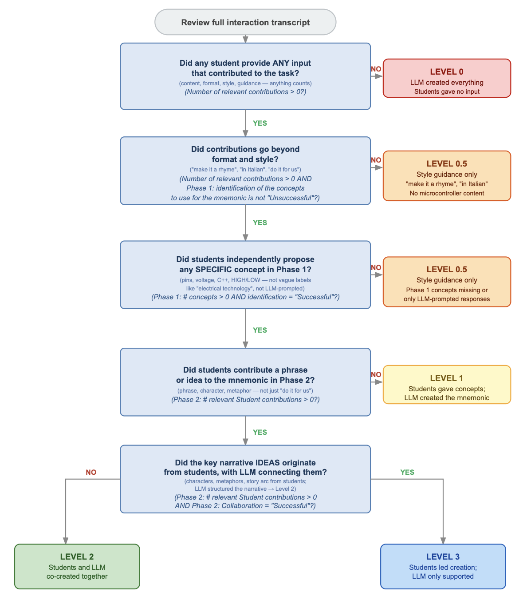
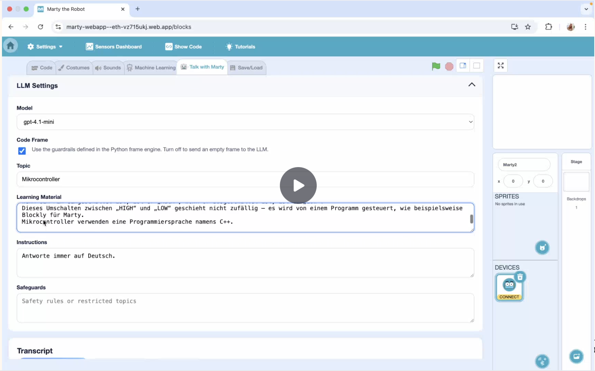
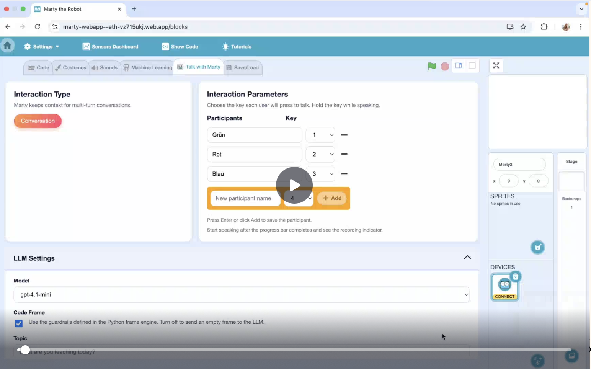
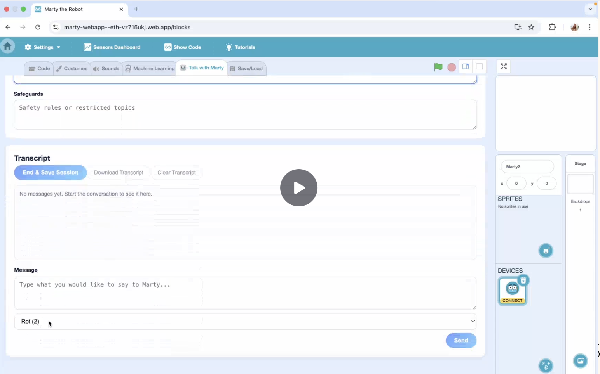

# S4: Classroom Pilot Study - Methods and Materials

## 1. Measures

**Note**: The questionnaires were presented in German; English versions shown here for documentation. Please contact the authors if you wish to obtain the German version.

### 1.1 Knowledge Assessment

**Instrument**: Multiple-choice questionnaire developed by the researchers

**Administration**: The knowledge assessment was administered at three time points during the study. At T1 (pre-session), students completed 2 items to establish baseline knowledge. At T2 and T3 (post-sessions), students completed 10 items, which included the 2 repeated items from T1 plus 8 new items assessing microcontroller fundamentals, programming concepts, and technical specifications.

**Scoring**: Each item was scored as correct (1) or incorrect (0).

**Items**: Complete item text, German translations, and psychometric properties are available in the codebook: [`LLM_microcontrollers-Table 1.csv`](../../Data_analysis/Data/Qualtrics/Buildbots_Codebook_15122025-2/LLM_microcontrollers-Table%201.csv)

**Content summary**: The 10 items assessed understanding of:
- Microcontroller definition and core components (Items 1-3)
- Power requirements and voltage specifications (Item 4-5)
- Pin states and control mechanisms (HIGH/LOW states) (Items 6-8)
- Program execution capabilities (Item 9)
- Programming languages for microcontrollers (Item 10)

------------------------------------------------------------------------

### 1.2 Student Feedback Measures

#### 1.2.1 General Activity Engagement

**Instrument**: Post-activity questionnaire adapted from Heindl et al. (2020)

**Administration**: After each learning session

**Scale**: Responses were collected on a 5-point Likert scale ranging from 1 (Does not apply) to 5 (Very true), with intermediate points at 2 (Not very true), 3 (Somewhat true), and 4 (Quite true).

**Items**: Eight items assessing interest/enjoyment (2 items), perceived competence (3 items), pressure/tension (2 items), and value/usefulness (2 items). Complete item text, German translations, subscale assignments, and source information are available in the codebook: [`Intrinsic motivation inventory-Table 1.csv`](../../Data_analysis/Data/Qualtrics/Buildbots_Codebook_15122025-2/Intrinsic%20motivation%20inventory-Table%201.csv)

**Reference**: Adapted from Heindl, M. (2020). An extended short scale for measuring intrinsic motivation when engaged in inquiry-based learning. *Journal of Pedagogical Research*, 4(1), 22–30. https://doi.org/10.33902/JPR.2020057989

#### 1.2.2 LLM Interaction Experience

**Instrument**: Custom questionnaire developed for this study

**Administration**: After voice interaction session with Marty

**Items**: Five items including quantitative ratings (enjoyment, learning support, participation balance) and open-ended responses (likes, dislikes). Complete item text, German translations, and scale anchors are available in the codebook: [`LLM_interaction-Table 1.csv`](../../Data_analysis/Data/Qualtrics/Buildbots_Codebook_15122025-2/LLM_interaction-Table%201.csv)

**Domains assessed**:
- **Enjoyment** (LLM_enjoyment): 5-point scale from "Very bad" to "Very good"
- **Learning support** (LLM_learning): 5-point scale from "Very little" to "Very much"
- **Participation equity** (LLM_contributions): 4-point scale assessing perceived balance of contributions
- **Open feedback** (LLM_liked, LLM_disliked): Qualitative responses about positive and negative aspects

### 1.3 Teacher Feedback

**Instrument**: Custom post-lesson questionnaire

**Administration**: After each lesson session

**Items**: Complete item text, German translations, and scale anchors are available in the codebook: [`BuildbotAnalysis - Teachers.csv`](../../Data_analysis/Data/Qualtrics/Buildbots_Codebook_15122025-2/BuildbotAnalysis%20-%20Teachers.csv)

#### 1.3.1 General Lesson Evaluation

**Purpose**: Assess teacher perceptions of student engagement, learning, and lesson implementation

**Items** (administered after each lesson, n=5 quantitative + 3 open-ended):
- **engagement**: Student engagement compared to other lessons (5-point comparative scale)
- **questions**: Number of relevant student questions (5-point frequency scale)
- **difficulty_1**: Ease of guiding students through content (5-point difficulty scale)
- **difficulty_2**: Ease of managing student behavior (5-point difficulty scale)
- **learning**: Perceived student learning (5-point learning achievement scale)
- **positive**: Two things that went well (open-ended)
- **negative**: Two challenges or desired changes (open-ended)
- **qualitative**: Additional feedback (open-ended)

#### 1.3.2 LLM Interaction Evaluation (Teacher Perspective)

**Purpose**: Evaluate teacher perceptions of LLM-mediated learning effectiveness and appropriateness

**Items** (administered after LLM interaction sessions, n=3):
- **LLM_helpful**: Helpfulness of Marty interaction for learning (5-point scale, includes "I can't say" option)
- **LLM_easy**: Ease of LLM interaction for students (6-point scale, includes "I cannot judge" option)
- **LLM_engaging**: Entertainment value of interaction (6-point scale, includes "I can't say" option)

### 1.4 LLM Interaction Analysis Measures

Conversation transcripts were emailed to the researchers, translated to English, then manually coded and analysed to identify detailed characterization of student-LLM interactions, collaboration patterns, and learning processes across frame conditions.

**Data source**: The manual coding process is documented in [`BuildbotAnalysis - LLM analysis.csv`](../../Data_analysis/Data/BuildbotAnalysis%20-%20LLM%20analysis.csv), which contains all coded variables and derived measures.

The manual coding process generated multiple data columns that were analyzed to derive four key measures: (1) Contribution patterns with and without frame, (2) Co-creation level, (3) On-topic versus off-topic engagement, and (4) Individual participation patterns.

#### 1.4.1 Contribution Patterns (With Frame vs Without Frame)

This measure quantifies the total number and quality of student contributions in each experimental condition to assess how the pedagogical frame influences student engagement.

**Manual Coding Columns**: Six variables from the LLM analysis dataset track student contributions:
- Phase-specific counts: `Phase 1: Number of Concepts Proposed by Students`, `Phase 2: Number of Relevant Student Contributions`
- Condition-specific turn counts: `Number of Turns in Frame`, `Number of Turns in No Frame`
- Contribution quality: `Number of Relevant Contributions`, `Non-Relevant Contributions`

**Analysis**: Phase 1 and Phase 2 relevant contributions were summed to calculate total student relevant contributions with the SCAFFOLD framework, which was compared to baseline (no-frame) sessions to quantify the framework's impact on active student engagement.

#### 1.4.2 Co-Creation Level

**Description**: This measure assesses the degree of student agency in the learning process, ranging from passive reception of LLM-generated content to active leadership in knowledge construction.

**Scale**: Ordinal scale : 0, 0.5, 1, 2, 3:
- **0**: LLM generated all content (no student agency)
- **0.5**: Guidance only - students contributed only format/style directives, no learning content
- **1**: Students provided concepts; LLM created rest (minimal agency)
- **2**: Students provided concepts; co-created mnemonic with LLM (moderate agency)
- **3**: Students led most of the creation process (high agency)

*Figure: Decision tree used to assign co-creation levels based on the nature and origin of student contributions during LLM-mediated sessions.*

**Manual Coding Columns Contributing to This Measure**:

\- **Phase 1: Identification of Concepts**: Coded presence and quality of concept identification activity

\- **Phase 1: Concepts Identified**: List of concepts successfully identified by group

\- **Phase 1: Number of Concepts Proposed by Students**: Count of student-generated concept suggestions

\- **Phase 1: Collaboration**: Quality rating of collaborative work during concept identification

\- **Phase 2: Creation of a Mnemonic**: Coded presence and quality of mnemonic creation activity

\- **Phase 2: Student Contributions**: Total number of student inputs during creation

\- **Phase 2: Number of Relevant Student Contributions**: Count of substantive, on-topic contributions during creation

\- **Created Mnemonic**: Text of final mnemonic produced

\- **Phase 2: Length of the Mnemonic**: Measured in sentences or lines

\- **Phase 2: Mnemonic Depth**: Conceptual sophistication coded as Easy (surface-level: what is it and what does it do?), Medium (process-level: how does it work?), or Advanced (technical precision with specific terminology such as 3V, ESP32, HIGH/LOW states)

\- **Phase 2: Collaboration**: Quality rating of collaborative work during mnemonic creation

\- **Phase 3: Reciting the Mnemonic**: Coded presence and quality of mnemonic practice activity

\- **Closing**: Quality of session conclusion

\- **After Closing**: Post-session interactions or extensions

\- **Number of Concepts: Misunderstanding → Correct**: Count of misconceptions successfully resolved during interaction

**Analysis**: The co-creation level was coded holistically based on all Phase 1, Phase 2, and Phase 3 indicators. Mixed-effects models (accounting for students nested within groups) tested whether co-creation level predicted knowledge scores at T2 (immediate post-test) and T3 (delayed post-test). Linear regression examined whether baseline knowledge (T1) predicted co-creation level to assess potential confounding effects.

#### 1.4.3 On-Topic versus Off-Topic Engagement

**Description**: This measure characterizes conversation focus and the frame's effectiveness in maintaining or redirecting student attention toward learning objectives.

**Manual Coding Columns Contributing to This Measure**:

\- **Out of Topic Turns (with frame)**: Turns deviating from learning objectives in frame condition

\- **Out of Topic Turns (without frame)**: Turns deviating from learning objectives in control condition

\- **Number of Turns in Frame**: Total turns in frame condition (denominator for percentage calculation)

\- **Number of Turns in No Frame**: Total turns in control condition (denominator for percentage calculation)

\- **Percentage of Turns from Off-Topic to On-Topic**: Rate of conversational redirection toward learning goals

\- **Balanced Turns Management**: Assessment of whether the frame was able to suggest the next speaker in equitable way

**Analysis**: Off-topic turn counts were summed across groups for each condition, then divided by total turns to calculate the percentage of off-topic engagement. This quantified the frame's effectiveness in maintaining learning focus (percentage on-topic = 100% - percentage off-topic).

#### 1.4.4 Individual Participation Patterns and Balance

**Description**: This measure tracks individual student engagement within groups to assess participation equity and identify patterns of dominance or disengagement. Participation balance is quantified using the Gini coefficient applied to individual turn counts.

**Manual Coding Columns Contributing to This Measure**:

\- **No Frame: Student 1**: Individual turn count in control condition

\- **No Frame: Student 2**: Individual turn count in control condition

\- **No Frame: Student 3**: Individual turn count in control condition

\- **With Frame: Student 1**: Individual turn count in frame condition

\- **With Frame: Student 2**: Individual turn count in frame condition

\- **With Frame: Student 3**: Individual turn count in frame condition

**Derived Metric**: Gini coefficient (G', without self-pairing), a measure of inequality in contribution distribution (0 = perfect equality, 1 = maximum inequality)

$$G' = \frac{\sum_{i=1}^{n} (2i - n - 1) \cdot x_i}{2\bar{x} \cdot n \cdot (n-1)}$$

Where $x_i$ represents the contribution count for student $i$ (sorted in ascending order), $i$ is the rank index (1 to $n$), $n$ is the number of students in group, and $\bar{x}$ is the mean contribution count.

**Reference**: Dixon, P. M., Weiner, J., Mitchell-Olds, T., & Woodley, R. (1987). Bootstrapping the Gini Coefficient of Inequality. *Ecology*, 68(5), 1548–1551. https://doi.org/10.2307/1939238

**Analysis**: Individual turn counts for each student were used to calculate a Gini coefficient (balance score) for each group in both the "With Frame" and "Without Frame" conditions. Wilcoxon signed-rank test compared paired balance scores to assess whether the SCAFFOLD framework promoted more equitable participation. Variance in Gini scores was also compared between conditions to evaluate consistency of participation balance.

------------------------------------------------------------------------

## 2. Materials and Technology

### 2.1 Marty the Robot

**Description**: Marty the Robot (Robotical Ltd., Edinburgh, UK) is a humanoid walking robot designed for STEAM education. Marty features a unique walking mechanism and individually powered limbs, enabling it to walk, turn, dance, sidestep, kick a ball, and perform expressive movements. Designed for learners as young as 4, Marty supports progression from screen-free programming to block-based and text-based coding (Python), making abstract coding concepts tangible through physical embodiment ([Robotical, 2026](https://robotical.io/about/all-about-marty/)).

**Technical Specifications**: Marty is a humanoid robot with individually powered limbs equipped with acceleration and tilt sensors, motors with position sensors, and foot sensors capable of color and light detection. Multiple servo motors control limb movements, while a built-in speaker supports speech synthesis in over 40 languages. The robot operates on a rechargeable battery providing up to 3 hours of continuous operation and features multiple connectivity options including Bluetooth, WiFi, USB, and I2C interfaces, with compatibility across PC, Chromebook, Mac, iOS, and Android devices.

**Role in Study**: In this study, Marty served as the physical embodiment of the AI tutor, a demonstration platform for microcontroller concepts, and an engagement and motivation tool.

**Acknowledgment**: Robotical Ltd. kindly loaned the Marty robots for this study and provided technical assistance with the interface integration.

### 2.2 Web Interface

**Platform**: A custom web interface was deployed for this study, based on the standard Robotical web application (<https://webapp.robotical.io>). The interface was modified to integrate the SCAFFOLD pedagogical framework and support the experimental design requirements.

**Features**: The web interface provided students with:

- **Voice interaction**: Integrated speech recognition and synthesis for natural conversation with Marty the Robot
- **LLM Settings panel**: Comprehensive configuration options including:
  - **Model selection**: Dropdown menu for choosing the LLM model (e.g., gpt-4.1-mini)
  - **Code Frame toggle**: Checkbox to enable/disable the SCAFFOLD pedagogical framework guardrails
  - **Topic specification**: Field to define the learning topic (e.g., "Mikrocontroller")
  - **Learning Material**: Text area for inputting or modifying the instructional content that the LLM uses as reference
  - **Instructions**: Custom directives for the LLM's behavior (e.g., language preferences)
  - **Safeguards**: Safety rules or restricted topics to constrain the LLM's responses
- **Transcript display**: Real-time conversation log showing the dialogue between students and Marty

**Data Privacy**: To ensure compliance with data protection regulations, interaction data was not stored on any server. Instead, all conversation data was temporarily stored in browser cookies during the session and then sent directly by email to the researchers upon session completion. This approach ensured that no student data was retained on external servers.

*Figure 1: Screenshot of the custom web interface showing the LLM Settings panel (left) with configurable frame options, learning materials, and instructions, alongside the stage view with Marty and conversation controls (right).*

*Figure 2: Detailed view of the Interaction Type and Interaction Parameters sections, showing the participant management interface where teachers could configure which students participate and assign keyboard shortcuts for multi-turn conversations.*

*Figure 3: Lower section of the interface showing the Safeguards field (for defining restricted topics), Transcript display (showing conversation history), and the Message input area where students could type messages to Marty with participant selection dropdown.*

### 2.3 Learning Materials

**Topic**: Microcontrollers

**Content**: [`microcontrollers.md`](https://github.com/OlgaMuss/BuildBot/tree/main/LLM_Frames_Design/frame_engine_v1.1.2/microcontrollers.md)

**Key Concepts**: The learning materials covered fundamental microcontroller concepts including what a microcontroller is, its key components (CPU, memory, pins), programming approaches (Blockly, C++), applications in robots and IoT devices, and specific examples such as ESP32 and Arduino Nano.

------------------------------------------------------------------------

## 3. References

Dixon, P. M., Weiner, J., Mitchell-Olds, T., & Woodley, R. (1987). Bootstrapping the Gini Coefficient of Inequality. *Ecology*, 68(5), 1548–1551. https://doi.org/10.2307/1939238

Heindl, M. (2020). An extended short scale for measuring intrinsic motivation when engaged in inquiry-based learning. *Journal of Pedagogical Research*, 4(1), 22–30. https://doi.org/10.33902/JPR.2020057989

Robotical. (2026). Marty the Robot – STEM & Coding Robot for Education. Retrieved from https://robotical.io/about/all-about-marty/

------------------------------------------------------------------------

**Contact**: - Luca Leisten: [luca.leisten\@gess.ethz.ch](mailto:luca.leisten@gess.ethz.ch) - Olga Muss: [olga.muss\@unine.ch](mailto:olga.muss@unine.ch)