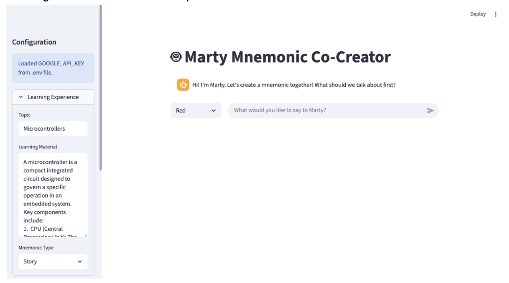
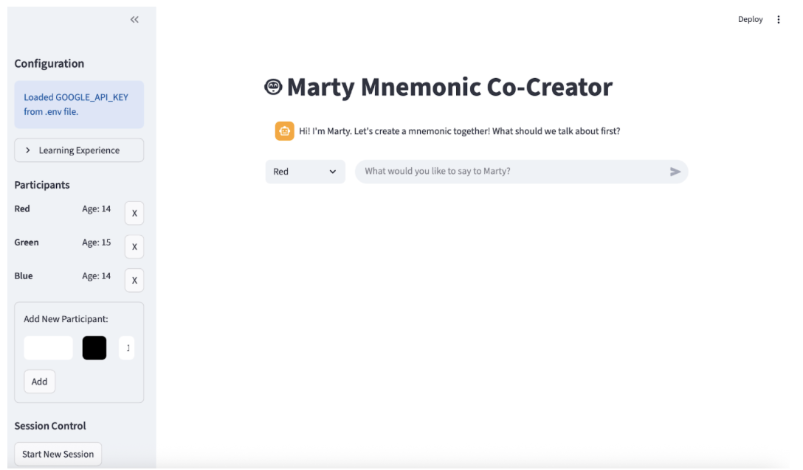

# Supplementary Material S3: Testing Methodology and Results

**Paper Title:** Scaffolding Student-AI Dialogue: A Layered Steering Framework for Safe Educational Interactions

**Authors:** Olga Muss, Luca Leisten, Charles Edouard Bardyn

------------------------------------------------------------------------

## Table of Contents

1.  [Testing Strategy](#1-testing-strategy)
2.  [Manual Testing](#2-manual-testing)
3.  [Static Unit Tests](#3-static-unit-tests)
4.  [Dynamic Simulations](#4-dynamic-simulations)

------------------------------------------------------------------------

## 1. Testing Strategy

Four-tier validation approach:

**Table S3.1**: Testing methodology tiers

| Tier | Method | Purpose | Frequency |
|------------------|------------------|------------------|--------------------|
| **Manual** | Interactive Streamlit interface | Edge case discovery, frame refinement | Continuous during development |
| **Unit Tests** | pytest with actual LLM calls | Automated behavior verification | Every code change |
| **Simulations** | Synthetic personas, multi-turn | Frame composition testing | Pre-deployment |
| **Classroom** | Real students (N=9 groups) | Real-world validation | Final deployment |

------------------------------------------------------------------------

## 2. Manual Testing

**Interface**: Streamlit web app ([`scripts/frontend.py`](https://github.com/OlgaMuss/BuildBot/blob/main/LLM_Frames_Design/frame_engine_v1.1.2/code/scripts/frontend.py))

**Method**: Developers role-play student personas, deliberately test edge cases.

### Interface Screenshots

**Figure S3.1**: Streamlit interface with configuration panel collapsed, showing the main chat interface where Marty initiates the mnemonic co-creation session.



**Figure S3.2**: Streamlit interface with configuration panel expanded, showing learning experience settings (topic, learning material, mnemonic type), participant management (names and ages), and session controls.



### Manual Testing Findings

**Key Findings**: - Technical terms flagged as too complex → Added lesson context whitelist - AI continued inviting students after closure → Added explicit "do not invite" instruction - Turn-taking ties inconsistent → Added secondary sort by speaking time - Turn-based phases caused groups to get stuck → Changed to time-based transitions

------------------------------------------------------------------------

## 3. Static Unit Tests

**Framework**: pytest with async support\
**Location**: [`tests/`](https://github.com/OlgaMuss/BuildBot/tree/main/LLM_Frames_Design/frame_engine_v1.1.2/code/tests)\
**Coverage**: 8 user stories, 7 test files, 50 test functions

### Test File Breakdown

**Table S3.2**: Static unit test files and coverage

| Test File | Tests | Focus |
|-----------------------|---------------|---------------------------------|
| `test_balanced_turns.py` | 19 | Turn-taking validation: correct/incorrect next speaker, monopolization detection (3+ consecutive), underparticipation handling, validation pass/fail/revise scenarios |
| `test_comprehension_tracker.py` | 12 | Concept extraction, per-student comprehension assessment (UNDERSTOOD/CONFUSED/MISCONCEPTION), dual analysis (understanding + confusion), prompt section generation |
| `test_engine.py` | 8 | Pipeline execution (slot ordering), validation loop (PASS/REVISE/FAIL), prompt accumulation, multi-frame composition |
| `test_language_checker.py` | 3 | Age-appropriate vocabulary and sentence complexity, context-aware language validation |
| `test_marty.py` | 5 | Participation tracking, phase transitions, off-topic detection and redirection |
| `test_phases_checker.py` | 2 | Time-based phase progression, phase-appropriate content validation |
| `test_llm.py` | 1 | LLM provider configuration and API key validation |

### User Story Coverage

**Table S3.3**: User stories mapped to test files

| User Story | Test Files | Key Functionality |
|---------------------|---------------------|-------------------------------|
| **US1: Pipeline Execution** | `test_engine.py` | All slots execute in order, multiple frames compose correctly |
| **US2: Validation Loop** | `test_engine.py` | PASS/REVISE/FAIL actions handled correctly, max repair attempts enforced |
| **US3: Prompt Accumulation** | `test_engine.py` | Sections from multiple frames accumulated with proper formatting |
| **US4: Turn-Taking Management** | `test_marty.py`, `test_balanced_turns.py` | Participation tracking, monopolization detection, fair next speaker suggestion |
| **US5: Phase Transitions** | `test_marty.py`, `test_phases_checker.py` | Time-based phase progression (0-3min, 3-9min, 9+min) |
| **US6: Comprehension Tracking** | `test_comprehension_tracker.py` | Per-concept, per-student comprehension assessment and tracking |
| **US7: Focus Management** | `test_marty.py` | Off-topic detection and redirection after 2+ consecutive off-topic turns |
| **US8: LLM Configuration** | `test_llm.py` | Multi-provider support (Google, OpenAI, Anthropic), config validation |

**Running Tests**:

``` bash
cd frame_engine_v1.1.2/code
poetry install
echo 'GOOGLE_API_KEY="your-key"' > tests/.env
poetry run python -m pytest -v
```

------------------------------------------------------------------------

## 4. Dynamic Simulations

**Location**: [`simulations/`](https://github.com/OlgaMuss/BuildBot/tree/main/LLM_Frames_Design/frame_engine_v1.1.2/code/simulations)

### Three Synthetic Student Personas

The simulation system uses three distinct 14-year-old student personas, each powered by Google Gemini models, to test multi-turn collaborative mnemonic creation sessions:

**Table S3.4**: Synthetic student personas for simulations

| Persona | Personality & Style | Knowledge Level | Primary Testing Focus |
|-----------------|-------------------|-----------------|--------------------|
| **Red** | Enthusiastic, high energy, thinks out loud, starts ideas first | Knows basics (tiny computers, pins exist), confused about how pins work and HIGH/LOW states | Initial idea generation, building rough concepts, letting others refine |
| **Blue** | Thoughtful, asks clarifying questions, builds on others' ideas | Understands HIGH/LOW states well, confused about how programs work and Blockly vs C++ | Refinement, synthesis, polishing ideas, asking "what if" questions |
| **Green** | Creative, makes connections, sees patterns, finds humor | Good at real-world connections, remembers ESP32 term, confused about CPU vs Memory differences | Creative angles, connecting technical concepts to everyday life, pattern recognition |

### Simulation Architecture

**Student Model**: Google Gemini (configurable via `--student_model`, default: `gemini-2.5-flash-lite`) **Frame Engine Model**: Configurable via `config.yaml` (Azure OpenAI, Google, Anthropic) **Session Phases**: - Phase 1 (0-3 min): Knowledge building and concept selection - Phase 2 (3-9 min): Mnemonic creation and refinement\
- Phase 3 (9+ min): Practice and recall testing

Each persona is given: - Detailed personality traits and speech patterns - Specific knowledge (what they understand vs. what confuses them) - Phase-specific behavioral guidelines - Example responses for each phase

**Persona Files**: [`simulations/personas/`](https://github.com/OlgaMuss/BuildBot/tree/main/LLM_Frames_Design/frame_engine_v1.1.2/code/simulations/personas) - `STUDENT_RED_PERSONA.md`, `STUDENT_BLUE_PERSONA.md`, `STUDENT_GREEN_PERSONA.md` - German versions: `*_DE.md` for multilingual testing

### Running Simulations

``` bash
cd frame_engine_v1.1.2/code

# Basic simulation (25 turns, Story mnemonic)
python simulations/run_simulation.py --scenario test_run --turns 25

# Test different mnemonic types
python simulations/run_simulation.py --scenario jokes_test --turns 20 --mnemonic_type Jokes

# German language simulation
python simulations/run_simulation.py --scenario german_test --turns 25 --language de --mnemonic_type Story

# Custom configuration
python simulations/run_simulation.py --scenario custom --turns 30 --age 14 --student_model gemini-2.5-flash-lite
```

### Simulation Outputs

Each simulation generates three files in `simulations/sessions/`:

1.  **Markdown Transcript** (`session_sim###_{scenario}_{timestamp}.md`):
    -   Full conversation with turn numbers
    -   Phase transitions and timestamps
    -   Frame validation results and repairs
    -   Final mnemonic and recall attempts
2.  **YAML State** (`session_sim###_{scenario}_{timestamp}.yaml`):
    -   Complete frame memory snapshots per turn
    -   Participation tracking (contribution counts, last speaker)
    -   Comprehension state (understood/confused concepts per student)
    -   Session metadata (topic, students, mnemonic type)
3.  **Prompt Log** (`session_sim###_{scenario}_{timestamp}_prompts.json`):
    -   Full prompts sent to LLM each turn
    -   Token counts and latency measurements
    -   Validation and repair prompt details

### Key Simulation Findings

**Turn-Taking Balance**: The `BalancedTurnsFrame` successfully maintained equitable participation across all simulations. When one student (e.g., Red) contributed 2+ times consecutively, the frame correctly suggested the least frequent speaker for the next turn.

**Phase Progression**: Time-based phase tracking worked reliably. Simulations transitioned from Phase 1 (knowledge building) → Phase 2 (mnemonic creation) → Phase 3 (recall practice) at appropriate intervals based on estimated elapsed time.

**Comprehension Tracking**: The `ComprehensionTrackerFrame` successfully identified and tracked student-specific misconceptions (e.g., Red confused about pins/HIGH-LOW, Blue confused about programming, Green confused about CPU vs Memory) and provided targeted scaffolding.

**Multilingual Support**: German simulations (`--language de`) successfully maintained German throughout the session, with personas using appropriate German terminology and Marty responding in German.

------------------------------------------------------------------------

## References

**Repository**: <https://github.com/OlgaMuss/BuildBot>

**Frame Engine**: `LLM_Frames_Design/frame_engine_v1.1.2/code/`

**Installation**:

``` bash
git clone https://github.com/OlgaMuss/BuildBot.git
cd BuildBot/LLM_Frames_Design/frame_engine_v1.1.2/code
poetry install
```

**Contact**: - Luca Leisten: [luca.leisten\@gess.ethz.ch](mailto:luca.leisten@gess.ethz.ch) - Olga Muss: [olga.muss\@unine.ch](mailto:olga.muss@unine.ch)